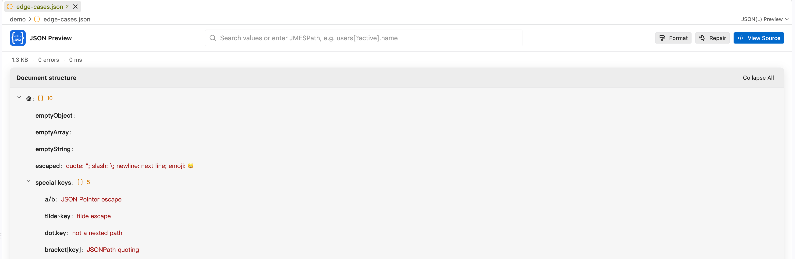
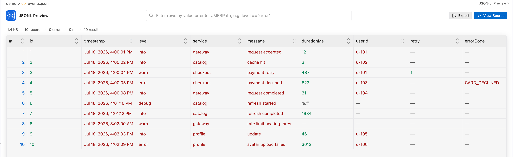
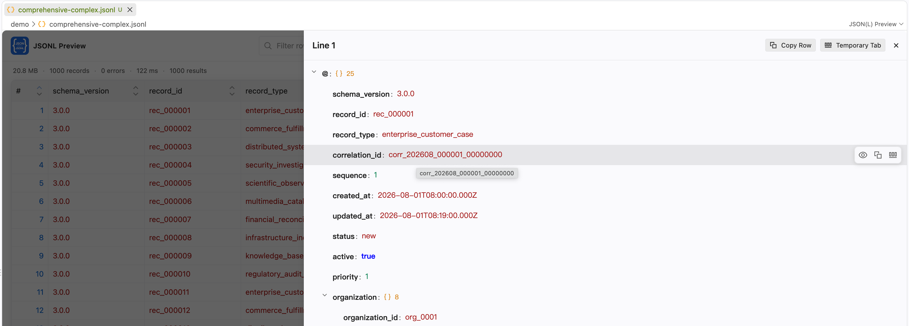

# JSON / JSONL Preview

[English](#english) | [简体中文](#简体中文)

## Examples

## English

A safe, paged VS Code preview for JSON, JSONL and NDJSON. It provides a lazy JSON tree, line-isolated JSONL diagnostics, filtering, stable sorting, locale-aware date display, JMESPath projection, source navigation, formatting, high-confidence repair previews, export, and format conversion.

Use **JSON(L) Preview: Open Preview** or **Open With...**. Clean local JSONL and NDJSON files above the configured threshold use the read-only streaming provider, so the extension host and webview never receive the complete file. JSON files, non-file URIs, and documents with unsaved changes use normal mode and are subject to its size limit.

Select JSON or JSON Lines content in any text editor, then right-click and choose **JSON(L) Preview: Preview Selection** to open it in a temporary preview document.

Enter a plain value to search JSON scalar values; in JSONL previews this filters the table to matching records. JMESPath expressions such as `users[?active].name` remain available for projections and structured record filtering. Right-click a node to copy data or a directly reusable JMESPath-compatible JSONPath; JSONL row details support the same actions.

String scalar values provide inline actions to view their full content, copy them, or open them in a temporary tab. Hold `Alt`/`Option` while opening content to reuse the current tab instead. The full-content viewer supports `Ctrl`/`Cmd`+`F` search and context-menu actions for selected text.

The preview does not execute workspace code or upload file content. Source changes are applied through VS Code edits and remain undoable.

### Settings

Settings are read when a preview opens. Reopen an existing preview after changing them.

| Setting | Default | Range / values | Effect |
| --- | ---: | --- | --- |
| `jsonlPreview.showEditorTitleIcon` | `true` | Boolean | Shows the preview action in the editor title bar. |
| `jsonlPreview.json.indent` | `2` | `1`–`8` | Spaces used by **Format Document**. |
| `jsonlPreview.json.allowComments` | `false` | Boolean | Allows comments in JSON previews only. |
| `jsonlPreview.json.allowTrailingComma` | `false` | Boolean | Allows trailing commas in JSON previews only. |
| `jsonlPreview.json.maxAutoExpandDepth` | `10` | `1`–`100` | Automatically expands the JSON tree through this level; deeper nodes can still be opened manually. |
| `jsonlPreview.jsonl.pageSize` | `1000` | `20`–`1000` | Records requested per JSONL/NDJSON page. |
| `jsonlPreview.jsonl.schemaSampleSize` | `1000` | `10`–`10000` | Initial records sampled to discover table columns. Fields that occur only later may not appear as columns. |
| `jsonlPreview.jsonl.ignoreEmptyLines` | `true` | Boolean | Ignores blank physical lines; when disabled, they appear as error rows. |
| `jsonlPreview.largeFileThresholdMB` | `50` | At least `1` | Switches clean local JSONL/NDJSON files above the threshold to read-only streaming mode. It does not apply to JSON. |
| `jsonlPreview.normalModeMaxFileMB` | `100` | `1`–`1024` | Maximum complete-file load in normal mode; also bounds conversion and non-file export. |
| `jsonlPreview.maxLineLengthMB` | `5` | `0.1`–`1024` | Maximum JSONL/NDJSON line parsed completely; longer lines become error rows with a truncated preview. |
| `jsonlPreview.maxSortableRows` | `1000000` | `1000`–`100000000` | Maximum indexed physical-line count for field sorting. Original-order sorting still works. |
| `jsonlPreview.queryCacheMB` | `128` | `8`–`4096` | Memory budget for the line index, query results, and sorting data. A broad query can exceed this budget. |
| `jsonlPreview.timezone` | `system` | `system` or IANA time zone | Displays recognized timestamps in this zone, for example `Asia/Shanghai`. Invalid zones leave the original value unchanged. |

Keep `largeFileThresholdMB` at or below `normalModeMaxFileMB`. Otherwise, a JSONL/NDJSON file between the two limits cannot enter streaming mode and is too large for normal mode. Large-file mode requires an unchanged local file and is read-only; opening its source explicitly loads the complete file into VS Code.

## 简体中文

一款安全、支持分页浏览的 VS Code JSON、JSONL 和 NDJSON 文件预览插件。它提供按需加载的 JSON 树、逐行隔离的 JSONL 错误诊断、筛选、稳定排序、适配界面语言的日期显示、JMESPath 投影、源码定位、格式化、高置信度修复预览、导出和格式转换等功能。

使用 **JSON(L) Preview: Open Preview** 命令或 **打开方式...（Open With...）** 即可打开预览。没有未保存修改的本地 JSONL 和 NDJSON 文件超过配置阈值后会使用只读流式读取，因此扩展宿主和 Webview 都不会接收完整文件内容。JSON 文件、非本地文件 URI 和包含未保存修改的文档使用普通模式，并受普通模式大小上限约束。

在任意文本编辑器中选中 JSON 或 JSON Lines 内容，右键选择 **JSON(L) 预览: 预览所选内容**，即可通过临时文档打开预览。

输入普通文本可以搜索 JSON 中的标量值；在 JSONL 预览中，则会筛选出匹配的记录。也可以使用 `users[?active].name` 等 JMESPath 表达式进行投影和结构化记录筛选。右键单击节点，可以复制数据或可直接复用、兼容 JMESPath 的 JSONPath；JSONL 行详情也支持相同操作。

字符串标量值提供行内操作，可查看完整内容、复制，或在临时标签页中打开。打开内容时按住 `Alt`/`Option`，则会改为复用当前标签页。完整内容查看器支持使用 `Ctrl`/`Cmd`+`F` 搜索，也支持通过右键菜单操作选中的文本。

本插件不会执行工作区代码，也不会上传文件内容。对源文件的修改均通过 VS Code 编辑操作应用，并且可以撤销。

### 设置项

设置在打开预览时读取。修改后，请重新打开已有预览。

| 设置项 | 默认值 | 范围 / 可选值 | 作用 |
| --- | ---: | --- | --- |
| `jsonlPreview.showEditorTitleIcon` | `true` | 布尔值 | 在编辑器标题栏显示预览操作入口。 |
| `jsonlPreview.json.indent` | `2` | `1`–`8` | **格式化文档** 使用的空格数。 |
| `jsonlPreview.json.allowComments` | `false` | 布尔值 | 仅允许 JSON 预览包含注释。 |
| `jsonlPreview.json.allowTrailingComma` | `false` | 布尔值 | 仅允许 JSON 预览包含尾随逗号。 |
| `jsonlPreview.json.maxAutoExpandDepth` | `10` | `1`–`100` | JSON 树自动展开到此层；更深节点仍可手动展开。 |
| `jsonlPreview.jsonl.pageSize` | `1000` | `20`–`1000` | 每页请求的 JSONL/NDJSON 记录数。 |
| `jsonlPreview.jsonl.schemaSampleSize` | `1000` | `10`–`10000` | 用于发现表格列的前置记录采样数；仅在更后面出现的字段可能不会成为表格列。 |
| `jsonlPreview.jsonl.ignoreEmptyLines` | `true` | 布尔值 | 忽略空白物理行；关闭后，空白行会显示为错误行。 |
| `jsonlPreview.largeFileThresholdMB` | `50` | 不小于 `1` | 本地且未修改的 JSONL/NDJSON 超过阈值后切换到只读流式模式；不适用于 JSON。 |
| `jsonlPreview.normalModeMaxFileMB` | `100` | `1`–`1024` | 普通模式完整加载文件的上限，同时约束格式转换和非本地导出。 |
| `jsonlPreview.maxLineLengthMB` | `5` | `0.1`–`1024` | 完整解析 JSONL/NDJSON 单行的上限；超长行会成为错误行并仅显示截断预览。 |
| `jsonlPreview.maxSortableRows` | `1000000` | `1000`–`100000000` | 允许按字段排序的已索引物理行数上限；按原始顺序排序仍可使用。 |
| `jsonlPreview.queryCacheMB` | `128` | `8`–`4096` | 行索引、查询结果和排序数据的内存预算；宽泛查询可能超出预算。 |
| `jsonlPreview.timezone` | `system` | `system` 或 IANA 时区 | 使用指定时区显示识别到的时间戳，例如 `Asia/Shanghai`；无效时区会保留原值。 |

建议让 `largeFileThresholdMB` 小于或等于 `normalModeMaxFileMB`。否则，大小介于两者之间的 JSONL/NDJSON 文件既不会进入流式模式，又会超过普通模式上限。大文件模式要求本地文件没有未保存修改，并且只读；显式打开源码会让 VS Code 完整加载文件。

## Changelog

### Unreleased

### 0.1.11 — 2026-08-26

- Added locale-aware date formatting for Chinese and English interfaces.
- Hold `Alt` while opening content to switch between a temporary preview tab and the current tab.

### 0.1.10 — 2026-08-26

- Added search to the full-content viewer.
- Added copy and open actions for string scalar values, with clearer temporary-tab hints and improved value layout.
- Simplified scalar-value expansion behavior and expanded the related test coverage.

### 0.1.9 — 2026-08-24

- Added an option to open JSON and JSONL content in the current tab.

### 0.1.8 — 2026-08-02

- Prevented the paginator from being clipped and duplicate drawer styles from being injected when reopening a preview.
- Improved grid performance by caching date formatters and memoizing the grid.

### 0.1.7 — 2026-08-01

- Added a context menu for selected text in the full-content viewer.

### 0.1.6 — 2026-07-26

- Added a VS Code theme-aware overlay background for loading states.

### 0.1.5 — 2026-07-26

- Added resizable JSONL columns and persisted column widths.
- Improved fixed table-header theme integration.
- Updated search and filter placeholders with JMESPath examples.

### 0.1.4 — 2026-07-24

- Included documentation images in the packaged extension.
- Limited source-map generation to watch builds and configured the VSCE GitHub branch.

### 0.1.3 — 2026-07-24

- Added localized descriptions for extension settings.
- Expanded the settings documentation and clarified large-file mode limits.

### 0.1.2 — 2026-07-20

- Added temporary-tab previews for JSONL rows and cells.
- Improved context-menu actions, icons, keyboard navigation, and drawer actions.
- Fixed source-file opening behavior.

### 0.1.1 — 2026-07-20

- Introduced the initial preview UI, selection-preview menu integration, and final extension package identity.

### 0.1.0 — 2026-07-19

- Initial release with JSON, JSONL, and NDJSON previews.
